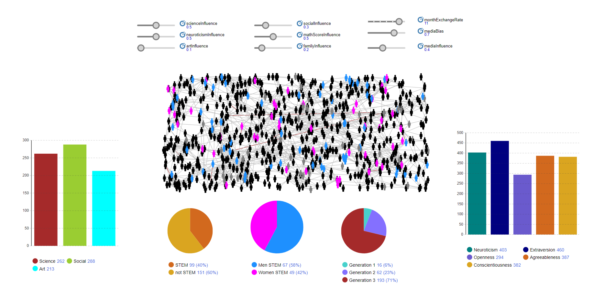
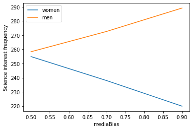
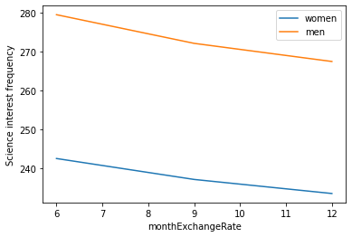

## __Decoding the STEM Gender Gap: Understanding the Factors at Play__

In recent years, women’s __under-representation__ in science, technology, engineering and math (STEM) fields has gained widespread attention in public, academic and policy circles. To help address this increased demand, widespread efforts have encouraged
women participation in STEM fields; although notable, such efforts would be bolstered by an __awareness__ of the __backgrounds__, __characteristics__ and personality traits of students who choose these paths to begin with. 

In this project, some of these factors are applied to model the dynamics of a __population__ of female and male individuals interacting, studying, being influenced by their environment and finally choosing whether to pursue a STEM career or not.
The main goal is exploiting simulated data to understand the __interplay__ between these factors, and possibly bring __new insights__ to light.

- To implement the model ([CSGenderGap.alp](https://github.com/aleceress/gendergap_simulation/blob/master/CSGenderGap.alp)), the [AnyLogic Simulation Software](https://www.anylogic.com/) was used.
- [report.pdf](https://github.com/aleceress/gendergap_simulation/blob/master/report.pdf) contains a detailed description of the implementation and a comprehensive analysis of obtained results.
- [results.ipynb](https://github.com/aleceress/gendergap_simulation/blob/master/report.pdf) contains the code written to analyze results.

 
